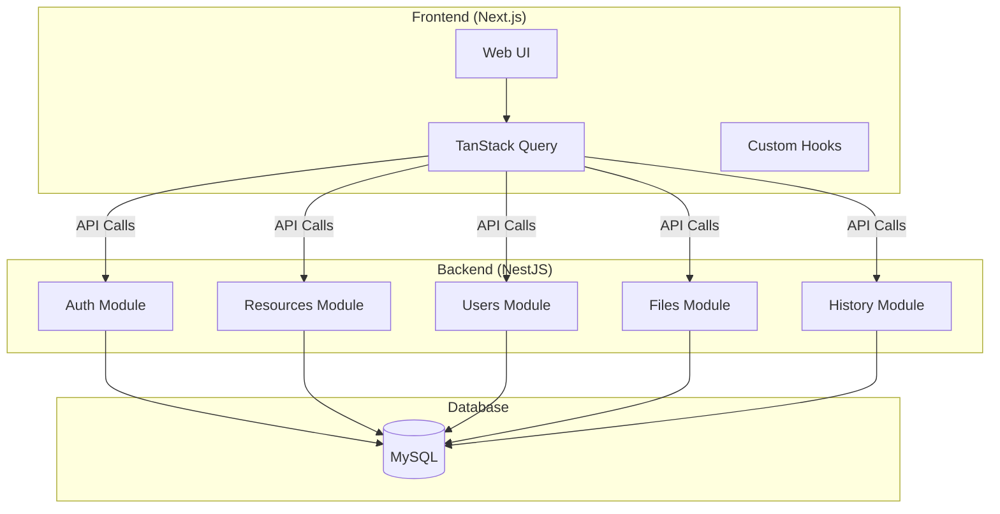
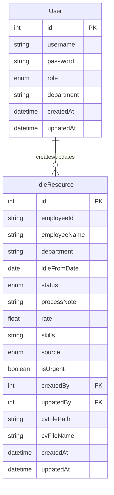
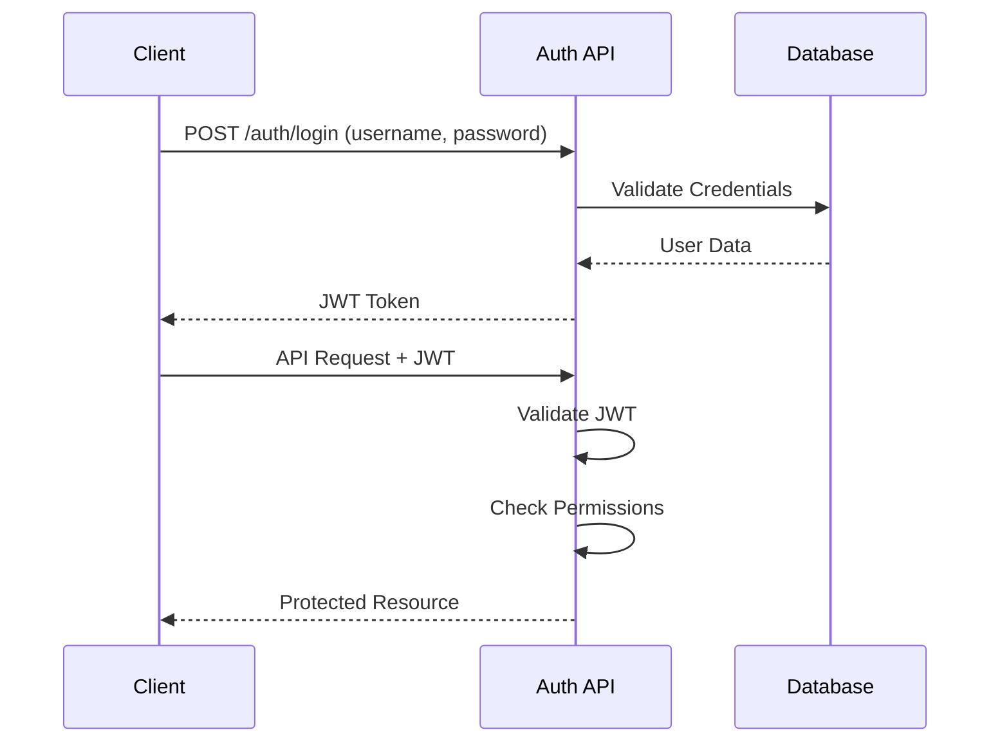

# Idle Resource Management System Architecture

## 1. System Architecture



## 2. Technology Stack

### Frontend
- **Next.js 15**: Modern React framework for production
  - Server-side rendering capabilities
  - File-based routing with App Router
  - API routes for backend integration

- **Material-UI v7**: React component library
  - Pre-built components following Material Design
  - Customizable theming
  - Integration with Tailwind CSS

- **Tailwind CSS v4**: Utility-first CSS framework
  - Direct integration with Material-UI
  - Custom styling and responsive design
  - No additional configuration needed

- **TanStack Query**: Data fetching and state management
  - Server state management
  - Automatic caching and revalidation
  - Real-time updates

### Backend
- **NestJS**: Node.js framework
  - Modular architecture
  - Built-in dependency injection
  - TypeScript support
  - Decorators for clean code structure

- **TypeORM**: Object-Relational Mapping
  - TypeScript integration
  - Repository pattern
  - Migration support
  - Change tracking

### Database
- **MySQL 8.0**: Relational database
  - ACID compliance
  - Strong data consistency
  - Rich query capabilities

## 3. Frontend Structure

```
frontend/
├── app/                      # Next.js App Router
│   ├── (auth)/              # Authentication routes
│   │   ├── login/
│   │   └── layout.tsx
│   ├── dashboard/           # Protected routes
│   │   ├── resources/
│   │   ├── users/
│   │   └── reports/
│   └── layout.tsx           # Root layout with providers
├── components/
│   ├── common/             # Shared components
│   │   ├── Layout/
│   │   ├── Navbar/
│   │   └── DataTable/
│   ├── resources/          # Feature components
│   └── users/
├── hooks/                  # Custom hooks
│   ├── useAuth.ts
│   ├── useResource.ts
│   └── useUser.ts
├── lib/                    # Utilities
│   ├── api.ts             # Axios instance
│   └── query.ts           # TanStack Query config
└── types/                 # TypeScript definitions
```

## 4. Backend Structure

```
backend/
├── src/
│   ├── modules/
│   │   ├── auth/          # Authentication
│   │   │   ├── guards/
│   │   │   ├── strategies/
│   │   │   └── dto/
│   │   ├── resources/     # Idle Resources
│   │   │   ├── entities/
│   │   │   ├── dto/
│   │   │   └── services/
│   │   ├── users/        # User Management
│   │   └── files/        # File Upload
│   ├── common/
│   │   ├── decorators/
│   │   ├── filters/
│   │   └── interceptors/
│   └── main.ts
└── test/                 # No tests for hackathon
```

## 5. Database Design

### Entity Relationships



## 6. Authentication Flow



## 7. File Management

- File upload using multer
- Supported formats: PDF, DOC, DOCX, XLS, XLSX
- File size limit: 10MB
- Storage: Local file system
- Naming convention: `{timestamp}-{originalname}`

## 8. Development Environment

### Docker Compose (MySQL Only)

```yaml
version: '3.8'
services:
  mysql:
    image: mysql:8.0
    environment:
      MYSQL_ROOT_PASSWORD: root
      MYSQL_DATABASE: idle_resource_db
    ports:
      - "3306:3306"
    volumes:
      - mysql_data:/var/lib/mysql

volumes:
  mysql_data:
```

### Port Configuration
- Frontend: 3001
- Backend: 3000
- MySQL: 3306

### Database Connection
```typescript
const config: TypeOrmModuleOptions = {
  type: 'mysql',
  host: 'localhost',
  port: 3306,
  username: 'root',
  password: 'root',
  database: 'idle_resource_db',
  entities: [User, IdleResource],
  synchronize: true, // Development only
  logging: true,
};
```

## 9. Security Considerations

### Role-Based Access Control
- Admin: Full system access
- RA: Resource management for assigned departments
- Manager: Department-level resource view and management
- Viewer: Read-only access to resources

### Data Access Control
- Department-based filtering
- Role-based visibility
- Audit logging for changes

### Input Validation
- Zod schemas for request validation
- TypeORM entity validation
- SQL injection prevention

## 10. Performance Optimization

### Frontend
- Material-UI + Tailwind CSS optimization
- React Query caching
- Lazy loading for routes
- Image optimization

### Backend
- Response caching
- Query optimization
- Pagination for large datasets
- Rate limiting