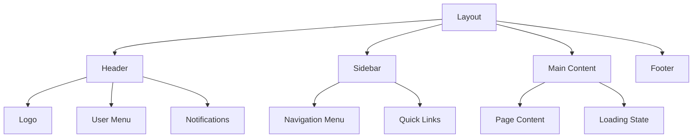
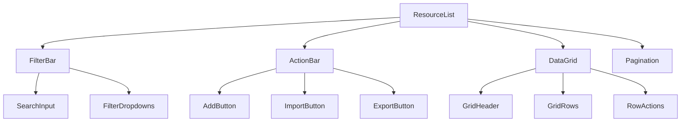
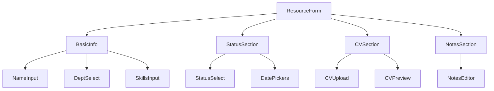
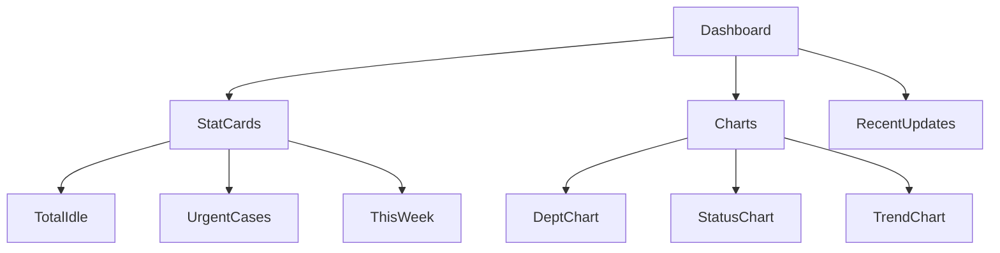

# Detail Design Document - Part 4: Component Implementation Details

## 4.1 Frontend Components

### 4.1.1 Common Components

#### Layout Component


Components:
1. Header
   - Logo + App Name
   - User profile dropdown
   - Notifications bell
   - Role indicator

2. Sidebar
   - Dynamic menu based on user role
   - Collapsible sections
   - Active state indicators

3. Main Content
   - Breadcrumb navigation
   - Content area
   - Loading states
   - Error boundaries

### 4.1.2 Resource Management Components

#### Resource List Component


Components:
1. FilterBar
   - Search input with debounce
   - Department filter dropdown
   - Status filter dropdown
   - Date range picker
   - Clear filters button

2. ActionBar
   - Add new resource button
   - Import Excel button
   - Export Excel button
   - Bulk actions dropdown

3. DataGrid
   - Sortable columns
   - Row selection
   - Inline actions
   - Status indicators
   - Responsive layout

### 4.1.3 Form Components

#### Resource Form Component


Form Validation Rules:
```typescript
const resourceFormSchema = z.object({
    name: z.string()
        .min(1, 'Name is required')
        .max(100, 'Name too long'),
    departmentId: z.number()
        .min(1, 'Department is required'),
    skills: z.array(z.string())
        .min(1, 'At least one skill required'),
    rate: z.number()
        .min(0, 'Rate must be ≥ 0'),
    status: z.enum(['ACTIVE', 'ASSIGNED', 'TRAINING']),
    idleFrom: z.date()
        .min(new Date('2020-01-01'), 'Invalid date'),
    idleTo: z.date()
        .nullable()
        .refine(date => !date || date > this.idleFrom, {
            message: 'End date must be after start date'
        }),
    processNotes: z.string()
        .max(1000, 'Notes too long')
        .optional()
});
```

### 4.1.4 Report Components

#### Dashboard Component


Chart Configurations:
1. Department Chart
   ```typescript
   const deptChartConfig = {
       type: 'bar',
       options: {
           responsive: true,
           maintainAspectRatio: false,
           scales: {
               y: {
                   beginAtZero: true,
                   title: {
                       display: true,
                       text: 'Number of Resources'
                   }
               }
           }
       }
   };
   ```

2. Status Chart
   ```typescript
   const statusChartConfig = {
       type: 'pie',
       options: {
           responsive: true,
           maintainAspectRatio: false,
           plugins: {
               legend: {
                   position: 'right'
               }
           }
       }
   };
   ```

### 4.1.5 Custom Hooks

```typescript
// Resource data fetching
const useResources = (filters: ResourceFilters) => {
    return useQuery({
        queryKey: ['resources', filters],
        queryFn: () => fetchResources(filters),
        keepPreviousData: true
    });
};

// Form management
const useResourceForm = (initialData?: Resource) => {
    const form = useForm({
        resolver: zodResolver(resourceFormSchema),
        defaultValues: initialData
    });
    
    return {
        form,
        onSubmit: async (data) => {
            try {
                await saveResource(data);
            } catch (error) {
                handleError(error);
            }
        }
    };
};

// File upload
const useFileUpload = () => {
    const upload = async (file: File) => {
        const formData = new FormData();
        formData.append('file', file);
        return await uploadFile(formData);
    };
    
    return { upload };
};
```
