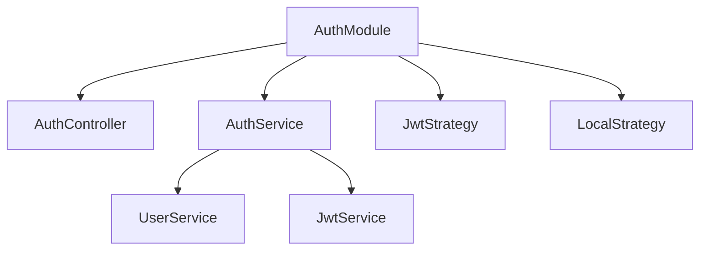
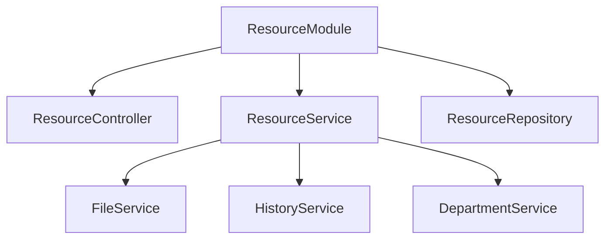

# Detail Design Document - Part 5: Backend Service Implementation

## 5.1 Module Structure

### 5.1.1 Auth Module


Key Components:
1. AuthController: Handles authentication endpoints
2. AuthService: Business logic for auth operations
3. JwtStrategy: JWT token validation
4. LocalStrategy: Username/password validation

### 5.1.2 Resource Module


Key Components:
1. ResourceController: REST API endpoints
2. ResourceService: Business logic
3. ResourceRepository: Database operations
4. Integration with other services

## 5.2 Service Implementations

### 5.2.1 Authentication Service
```typescript
interface AuthService {
    validateUser(username: string, password: string): Promise<User>;
    login(user: User): Promise<TokenResponse>;
    logout(token: string): Promise<void>;
    validateToken(token: string): Promise<TokenPayload>;
}

class AuthServiceImpl implements AuthService {
    private readonly jwtSecret: string;
    private readonly tokenExpiry: string;
    
    constructor(
        private readonly userService: UserService,
        private readonly jwtService: JwtService,
        private readonly sessionService: SessionService
    ) {}
    
    async validateUser(username: string, password: string): Promise<User> {
        // 1. Find user by username
        // 2. Verify password hash
        // 3. Check account status
        // 4. Return user or throw error
    }
    
    async login(user: User): Promise<TokenResponse> {
        // 1. Generate JWT token
        // 2. Create session record
        // 3. Return token and user info
    }
    
    async logout(token: string): Promise<void> {
        // 1. Invalidate session
        // 2. Clear user token
    }
}
```

### 5.2.2 Resource Service
```typescript
interface ResourceService {
    findAll(filters: ResourceFilters): Promise<PaginatedResponse<Resource>>;
    findById(id: number): Promise<Resource>;
    create(data: CreateResourceDto): Promise<Resource>;
    update(id: number, data: UpdateResourceDto): Promise<Resource>;
    delete(id: number): Promise<void>;
    import(file: Buffer): Promise<ImportResult>;
    export(filters: ResourceFilters): Promise<Buffer>;
}

class ResourceServiceImpl implements ResourceService {
    constructor(
        private readonly repository: ResourceRepository,
        private readonly fileService: FileService,
        private readonly historyService: HistoryService
    ) {}
    
    async findAll(filters: ResourceFilters): Promise<PaginatedResponse<Resource>> {
        // 1. Build query from filters
        // 2. Apply pagination
        // 3. Execute query
        // 4. Format response
    }
    
    async create(data: CreateResourceDto): Promise<Resource> {
        // 1. Validate input
        // 2. Create resource
        // 3. Create history record
        // 4. Return created resource
    }
    
    async update(id: number, data: UpdateResourceDto): Promise<Resource> {
        // 1. Find existing resource
        // 2. Validate changes
        // 3. Update resource
        // 4. Create history records
        // 5. Return updated resource
    }
}
```

### 5.2.3 File Service
```typescript
interface FileService {
    uploadCV(file: Buffer, metadata: FileMetadata): Promise<FileInfo>;
    downloadCV(fileId: number): Promise<Buffer>;
    deleteCV(fileId: number): Promise<void>;
}

class FileServiceImpl implements FileService {
    constructor(
        private readonly s3Client: S3Client,
        private readonly repository: FileRepository
    ) {}
    
    async uploadCV(file: Buffer, metadata: FileMetadata): Promise<FileInfo> {
        // 1. Validate file type and size
        // 2. Generate unique filename
        // 3. Upload to S3
        // 4. Save metadata to database
        // 5. Return file info
    }
}
```

### 5.2.4 Report Service
```typescript
interface ReportService {
    getDashboardStats(filters: ReportFilters): Promise<DashboardStats>;
    generateReport(type: ReportType, filters: ReportFilters): Promise<Buffer>;
}

class ReportServiceImpl implements ReportService {
    constructor(
        private readonly resourceService: ResourceService,
        private readonly departmentService: DepartmentService
    ) {}
    
    async getDashboardStats(filters: ReportFilters): Promise<DashboardStats> {
        // 1. Get total counts
        // 2. Calculate department stats
        // 3. Calculate status distribution
        // 4. Get trend data
        // 5. Format response
    }
}
```

## 5.3 Error Handling

### 5.3.1 Custom Exceptions
```typescript
class BusinessException extends Error {
    constructor(
        public readonly code: string,
        message: string,
        public readonly details?: any
    ) {
        super(message);
    }
}

class ValidationException extends BusinessException {
    constructor(details: ValidationError[]) {
        super('VAL001', 'Validation failed', details);
    }
}

class ResourceNotFoundException extends BusinessException {
    constructor(resourceId: number) {
        super('RES001', `Resource ${resourceId} not found`);
    }
}
```

### 5.3.2 Exception Filters
```typescript
@Catch()
export class GlobalExceptionFilter implements ExceptionFilter {
    catch(exception: Error, host: ArgumentsHost) {
        const ctx = host.switchToHttp();
        const response = ctx.getResponse<Response>();
        
        if (exception instanceof BusinessException) {
            response.status(400).json({
                success: false,
                error: {
                    code: exception.code,
                    message: exception.message,
                    details: exception.details
                }
            });
        } else {
            // Handle unexpected errors
            response.status(500).json({
                success: false,
                error: {
                    code: 'SYS001',
                    message: 'Internal server error'
                }
            });
        }
    }
}
