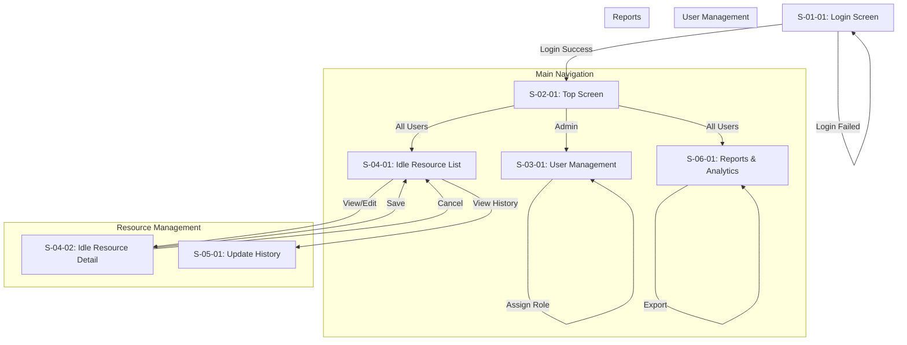

# Basic Design Document - Part 2: Screen Transition Diagram

## Screen Transition Flow

## Transition Rules

1. **Login Flow (S-01-01)**
   - Initial screen for all users
   - Redirects to Top Screen on successful login
   - Stays on Login screen with error message on failure

2. **Top Screen Flow (S-02-01)**
   - Central navigation hub
   - Access controlled by user role
   - Quick access to main features

3. **Resource Management Flow (S-04-XX)**
   - List view is the main entry point
   - Detail view accessible from list
   - History view accessible from list
   - All changes return to list view

4. **User Management Flow (S-03-01)**
   - Admin only access
   - Self-contained CRUD operations
   - Role management integrated

5. **Reports Flow (S-06-01)**
   - Accessible by all users
   - Interactive filtering
   - Export functionality
