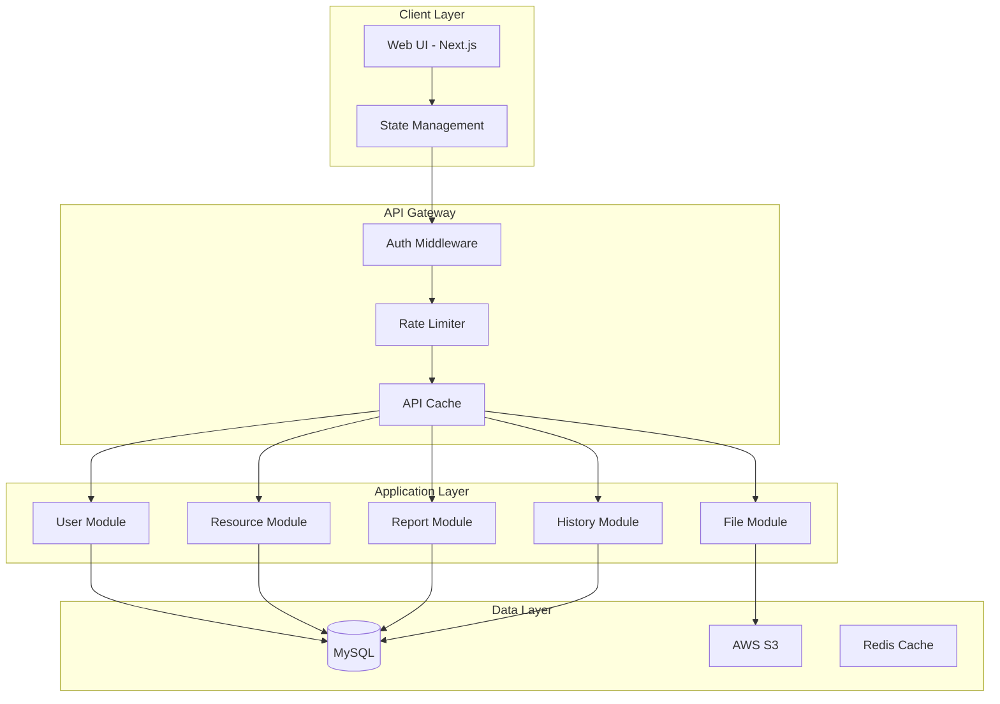
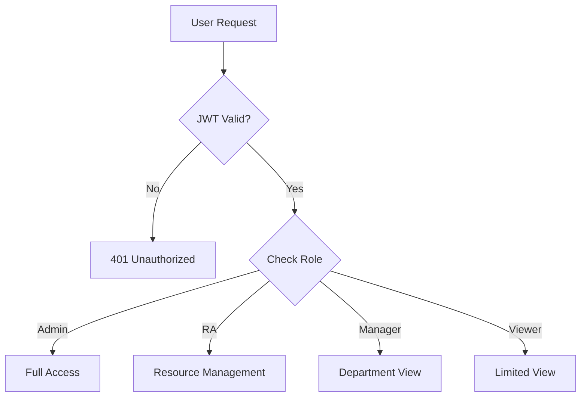
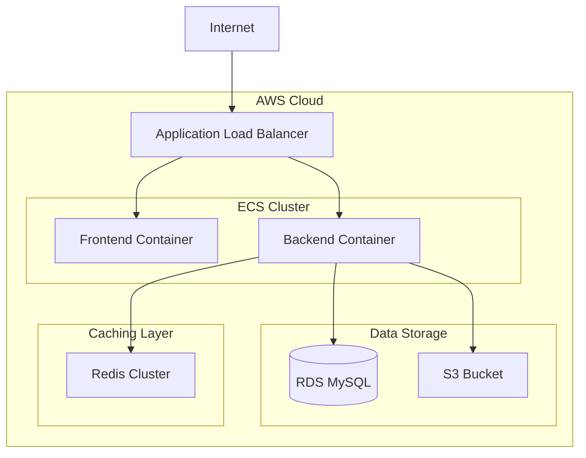

# Detail Design Document - Part 1: Technical Architecture Overview

## 1.1 Technology Stack Matrix

| Layer | Technology | Version | Purpose |
|-------|------------|---------|---------|
| Frontend Framework | Next.js | 14.0.0 | React-based web framework for SSR and routing |
| UI Library | Material-UI | 5.14.0 | Component library for consistent UI/UX |
| UI Styling | TailwindCSS | 3.3.0 | Utility-first CSS framework |
| State Management | React Query | 4.0.0 | Server state and cache management |
| Form Management | React Hook Form | 7.45.0 | Form handling and validation |
| Schema Validation | Zod | 3.21.0 | Type-safe form and API validation |
| API Client | Axios | 1.4.0 | HTTP client for API calls |
| Backend Framework | NestJS | 10.0.0 | Scalable Node.js server framework |
| ORM | TypeORM | 0.3.17 | Database ORM for TypeScript |
| Database | MySQL | 8.0 | Relational database |
| Authentication | Passport.js + JWT | 0.6.0 | Authentication middleware |
| File Storage | AWS S3 | - | CV file storage |
| Logging | Winston | 3.10.0 | Application logging |
| Monitoring | Prometheus + Grafana | - | Performance monitoring |

## 1.2 System Architecture Diagram



## 1.3 Component Architecture

### 1.3.1 Frontend Component Structure
```
src/
├── components/
│   ├── common/
│   │   ├── Layout/
│   │   ├── Forms/
│   │   └── UI/
│   ├── auth/
│   ├── resource/
│   ├── reports/
│   └── history/
├── hooks/
├── services/
├── utils/
└── pages/
```

### 1.3.2 Backend Module Structure
```
src/
├── modules/
│   ├── auth/
│   ├── users/
│   ├── resources/
│   ├── reports/
│   └── history/
├── common/
│   ├── guards/
│   ├── filters/
│   └── interceptors/
├── config/
└── utils/
```

## 1.4 Security Architecture

### 1.4.1 Authentication Flow
1. User login with username/password
2. Server validates credentials and issues JWT
3. JWT stored in HttpOnly cookie
4. Subsequent requests include JWT in Authorization header
5. Server validates JWT and user permissions

### 1.4.2 Authorization Levels


## 1.5 Deployment Architecture

### 1.5.1 Infrastructure Diagram

