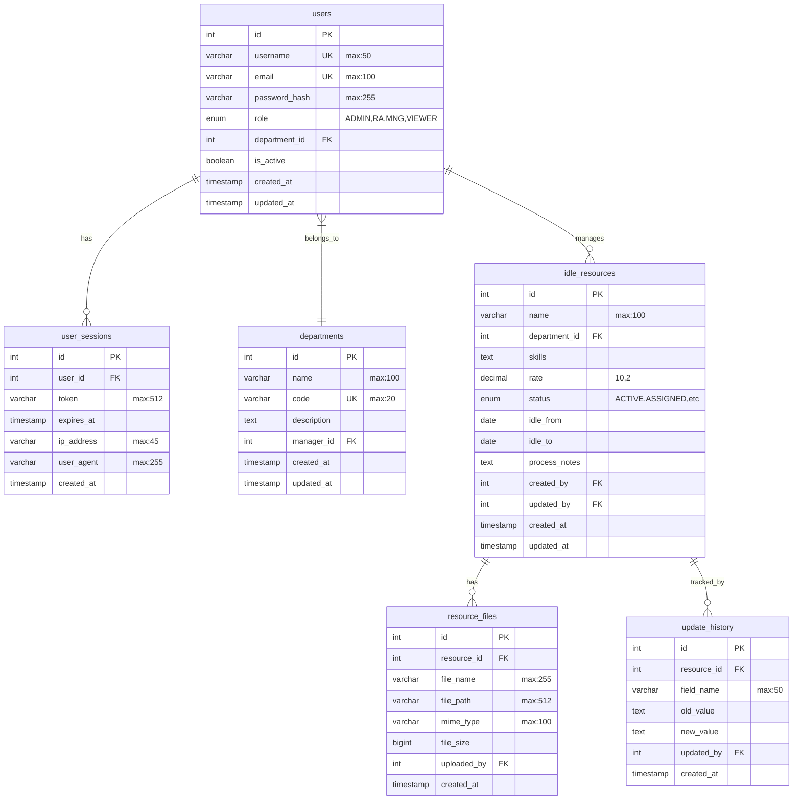

# Detail Design Document - Part 2: Database Design

## 2.1 Physical Data Model

### 2.1.1 Entity Relationship Diagram

## 2.2 Table Definitions

### 2.2.1 users
| Column | Type | Constraints | Description |
|--------|------|-------------|-------------|
| id | INT | PK, AUTO_INCREMENT | Unique identifier |
| username | VARCHAR(50) | NOT NULL, UNIQUE | Login username |
| email | VARCHAR(100) | NOT NULL, UNIQUE | User email |
| password_hash | VARCHAR(255) | NOT NULL | Bcrypt hashed password |
| role | ENUM | NOT NULL | User role: ADMIN,RA,MNG,VIEWER |
| department_id | INT | FK | Reference to departments.id |
| is_active | BOOLEAN | NOT NULL, DEFAULT true | Account status |
| created_at | TIMESTAMP | NOT NULL | Record creation time |
| updated_at | TIMESTAMP | NOT NULL | Record update time |

Indexes:
- PRIMARY KEY (id)
- UNIQUE KEY idx_username (username)
- UNIQUE KEY idx_email (email)
- KEY idx_department (department_id)
- KEY idx_role (role)

### 2.2.2 departments
| Column | Type | Constraints | Description |
|--------|------|-------------|-------------|
| id | INT | PK, AUTO_INCREMENT | Unique identifier |
| name | VARCHAR(100) | NOT NULL | Department name |
| code | VARCHAR(20) | NOT NULL, UNIQUE | Department code |
| description | TEXT | NULL | Department description |
| manager_id | INT | FK | Reference to users.id |
| created_at | TIMESTAMP | NOT NULL | Record creation time |
| updated_at | TIMESTAMP | NOT NULL | Record update time |

Indexes:
- PRIMARY KEY (id)
- UNIQUE KEY idx_code (code)
- KEY idx_manager (manager_id)

### 2.2.3 idle_resources
| Column | Type | Constraints | Description |
|--------|------|-------------|-------------|
| id | INT | PK, AUTO_INCREMENT | Unique identifier |
| name | VARCHAR(100) | NOT NULL | Resource name |
| department_id | INT | FK | Reference to departments.id |
| skills | TEXT | NOT NULL | JSON array of skills |
| rate | DECIMAL(10,2) | NOT NULL | Resource rate |
| status | ENUM | NOT NULL | Status: ACTIVE,ASSIGNED,etc |
| idle_from | DATE | NOT NULL | Idle start date |
| idle_to | DATE | NULL | Expected end date |
| process_notes | TEXT | NULL | Processing notes |
| created_by | INT | FK | Reference to users.id |
| updated_by | INT | FK | Reference to users.id |
| created_at | TIMESTAMP | NOT NULL | Record creation time |
| updated_at | TIMESTAMP | NOT NULL | Record update time |

Indexes:
- PRIMARY KEY (id)
- KEY idx_department (department_id)
- KEY idx_status (status)
- KEY idx_idle_period (idle_from, idle_to)
- KEY idx_created_by (created_by)

### 2.2.4 resource_files
| Column | Type | Constraints | Description |
|--------|------|-------------|-------------|
| id | INT | PK, AUTO_INCREMENT | Unique identifier |
| resource_id | INT | FK | Reference to idle_resources.id |
| file_name | VARCHAR(255) | NOT NULL | Original file name |
| file_path | VARCHAR(512) | NOT NULL | S3 storage path |
| mime_type | VARCHAR(100) | NOT NULL | File MIME type |
| file_size | BIGINT | NOT NULL | File size in bytes |
| uploaded_by | INT | FK | Reference to users.id |
| created_at | TIMESTAMP | NOT NULL | Upload time |

Indexes:
- PRIMARY KEY (id)
- KEY idx_resource (resource_id)
- KEY idx_uploaded_by (uploaded_by)

### 2.2.5 update_history
| Column | Type | Constraints | Description |
|--------|------|-------------|-------------|
| id | INT | PK, AUTO_INCREMENT | Unique identifier |
| resource_id | INT | FK | Reference to idle_resources.id |
| field_name | VARCHAR(50) | NOT NULL | Updated field name |
| old_value | TEXT | NULL | Previous value |
| new_value | TEXT | NULL | New value |
| updated_by | INT | FK | Reference to users.id |
| created_at | TIMESTAMP | NOT NULL | Update time |

Indexes:
- PRIMARY KEY (id)
- KEY idx_resource (resource_id)
- KEY idx_updated_by (updated_by)
- KEY idx_field (field_name)

### 2.2.6 user_sessions
| Column | Type | Constraints | Description |
|--------|------|-------------|-------------|
| id | INT | PK, AUTO_INCREMENT | Unique identifier |
| user_id | INT | FK | Reference to users.id |
| token | VARCHAR(512) | NOT NULL | Session token |
| expires_at | TIMESTAMP | NOT NULL | Session expiry time |
| ip_address | VARCHAR(45) | NOT NULL | Client IP address |
| user_agent | VARCHAR(255) | NOT NULL | Client user agent |
| created_at | TIMESTAMP | NOT NULL | Session start time |

Indexes:
- PRIMARY KEY (id)
- UNIQUE KEY idx_token (token)
- KEY idx_user (user_id)
- KEY idx_expires (expires_at)
