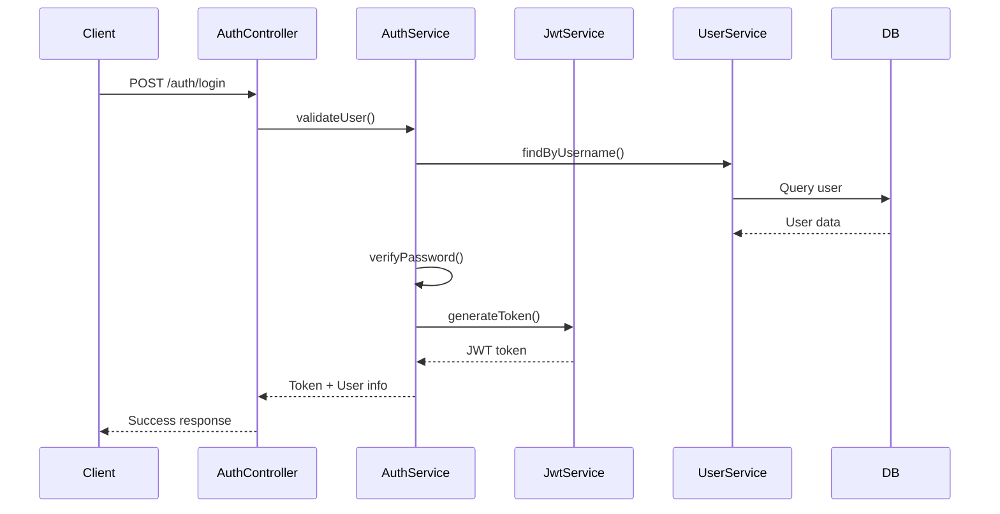
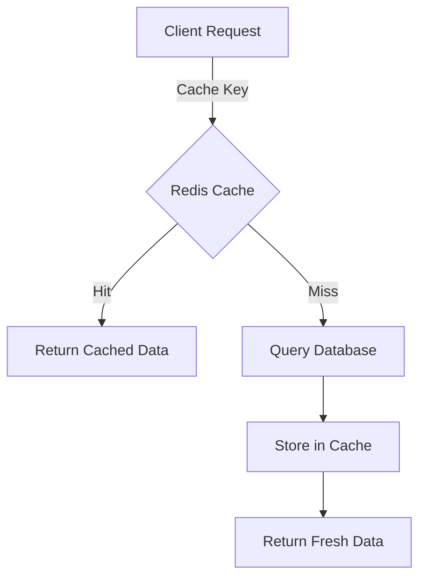

# Detail Design Document - Part 6: Security and Performance Considerations

## 6.1 Security Implementation

### 6.1.1 Authentication Implementation


### 6.1.2 Authorization Guards
```typescript
const RolePermissions = {
    ADMIN: [
        'user.manage',
        'resource.manage',
        'report.manage'
    ],
    RA: [
        'resource.manage',
        'report.view'
    ],
    MNG: [
        'resource.view',
        'resource.manage_dept',
        'report.view_dept'
    ],
    VIEWER: [
        'resource.view_limited',
        'report.view_limited'
    ]
} as const;

@Injectable()
class RoleGuard implements CanActivate {
    constructor(private reflector: Reflector) {}
    
    canActivate(context: ExecutionContext): boolean {
        const requiredPermissions = this.reflector.get<string[]>(
            'permissions',
            context.getHandler()
        );
        
        const { user } = context.switchToHttp().getRequest();
        return this.validatePermissions(user, requiredPermissions);
    }
}
```

### 6.1.3 Data Validation and Sanitization
```typescript
// Input validation using class-validator
class CreateResourceDto {
    @IsString()
    @Length(1, 100)
    name: string;

    @IsNumber()
    @Min(1)
    departmentId: number;

    @IsArray()
    @ArrayMinSize(1)
    @IsString({ each: true })
    skills: string[];

    @IsNumber()
    @Min(0)
    rate: number;

    @IsEnum(ResourceStatus)
    status: ResourceStatus;

    @IsDateString()
    idleFrom: string;

    @IsOptional()
    @IsDateString()
    idleTo?: string;
}

// XSS Prevention
const sanitizeMiddleware = (req, res, next) => {
    req.body = deepSanitize(req.body);
    next();
};
```

## 6.2 Performance Optimization

### 6.2.1 Caching Strategy


```typescript
@Injectable()
class CacheService {
    constructor(
        @Inject(CACHE_MANAGER) private cacheManager: Cache
    ) {}
    
    async get<T>(key: string): Promise<T | null> {
        return this.cacheManager.get(key);
    }
    
    async set<T>(key: string, value: T, ttl?: number): Promise<void> {
        await this.cacheManager.set(key, value, ttl);
    }
    
    generateKey(prefix: string, params: object): string {
        return `${prefix}:${hash(params)}`;
    }
}

// Implementation in ResourceService
@Injectable()
class ResourceService {
    constructor(private cacheService: CacheService) {}
    
    async findAll(filters: ResourceFilters): Promise<Resource[]> {
        const cacheKey = this.cacheService.generateKey('resources', filters);
        
        // Try cache first
        const cached = await this.cacheService.get<Resource[]>(cacheKey);
        if (cached) return cached;
        
        // Query database if not cached
        const resources = await this.repository.findAll(filters);
        
        // Store in cache
        await this.cacheService.set(cacheKey, resources, 300); // 5 minutes TTL
        
        return resources;
    }
}
```

### 6.2.2 Query Optimization
```typescript
@Injectable()
class ResourceRepository {
    // Optimized query with proper indexing
    async findAll(filters: ResourceFilters): Promise<Resource[]> {
        return this.createQueryBuilder('resource')
            // Join only necessary relations
            .leftJoin('resource.department', 'dept')
            .leftJoin('resource.files', 'file')
            
            // Select specific fields
            .select([
                'resource.id',
                'resource.name',
                'dept.name',
                'resource.status'
            ])
            
            // Apply filters
            .where(this.buildWhereClause(filters))
            
            // Use indexes effectively
            .orderBy('resource.updatedAt', 'DESC')
            
            // Paginate results
            .skip(filters.offset)
            .take(filters.limit)
            
            // Execute query
            .getMany();
    }
}
```

### 6.2.3 Background Jobs
```typescript
interface JobQueue {
    add(job: Job): Promise<void>;
    process(): void;
}

@Injectable()
class ImportJobQueue implements JobQueue {
    constructor(
        private readonly resourceService: ResourceService,
        private readonly notificationService: NotificationService
    ) {}
    
    async add(job: ImportJob): Promise<void> {
        // Add to queue with retry strategy
        await this.queue.add('import', job, {
            attempts: 3,
            backoff: {
                type: 'exponential',
                delay: 5000
            }
        });
    }
    
    async process(): Promise<void> {
        this.queue.process('import', async (job) => {
            // Process import in background
            const result = await this.resourceService.importResources(job.data);
            
            // Notify user when complete
            await this.notificationService.notify({
                userId: job.data.userId,
                type: 'IMPORT_COMPLETE',
                data: result
            });
        });
    }
}
```

## 6.3 Monitoring and Logging

### 6.3.1 Application Metrics
```typescript
interface MetricCollector {
    increment(metric: string, value?: number): void;
    gauge(metric: string, value: number): void;
    timing(metric: string, value: number): void;
}

@Injectable()
class PrometheusMetrics implements MetricCollector {
    private readonly counter: Counter;
    private readonly gauge: Gauge;
    private readonly histogram: Histogram;
    
    constructor() {
        // Initialize Prometheus metrics
        this.counter = new Counter({
            name: 'http_requests_total',
            help: 'Total HTTP requests',
            labelNames: ['method', 'path', 'status']
        });
        
        this.gauge = new Gauge({
            name: 'active_users',
            help: 'Number of active users'
        });
        
        this.histogram = new Histogram({
            name: 'http_request_duration_seconds',
            help: 'HTTP request duration',
            buckets: [0.1, 0.5, 1, 2, 5]
        });
    }
}
```

### 6.3.2 Logging Strategy
```typescript
interface Logger {
    info(message: string, context?: object): void;
    error(error: Error, context?: object): void;
    warn(message: string, context?: object): void;
    debug(message: string, context?: object): void;
}

@Injectable()
class WinstonLogger implements Logger {
    private logger: winston.Logger;
    
    constructor() {
        this.logger = winston.createLogger({
            level: 'info',
            format: winston.format.combine(
                winston.format.timestamp(),
                winston.format.json()
            ),
            transports: [
                new winston.transports.File({
                    filename: 'error.log',
                    level: 'error'
                }),
                new winston.transports.File({
                    filename: 'combined.log'
                })
            ]
        });
    }
    
    error(error: Error, context?: object): void {
        this.logger.error({
            message: error.message,
            stack: error.stack,
            ...context
        });
    }
}
