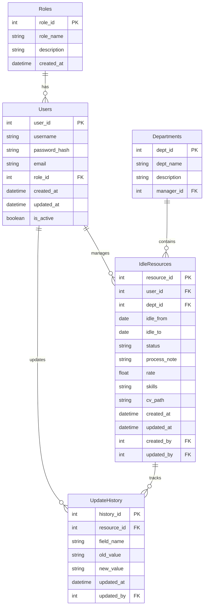

## 9. Danh sách các Entity cần thiết và ER diagram



## 10. Sơ đồ di chuyển chức năng trong hệ thống

```mermaid
flowchart TD
    Login[Login Screen] --> Auth{Authentication}
    Auth -->|Success| Top[Top Screen]
    Auth -->|Fail| Login
    
    Top -->|Admin| UserMgmt[User Management]
    Top -->|All Users| IdleList[Idle Resource List]
    Top -->|All Users| Report[Reports/Dashboard]
    
    UserMgmt -->|Add/Edit User| UserDetail[User Detail]
    UserMgmt -->|Assign Role| RoleAssign[Role Assignment]
    
    IdleList -->|View/Edit| IdleDetail[Idle Resource Detail]
    IdleList -->|Import| ImportIdle[Import Idle Data]
    IdleList -->|Export| ExportIdle[Export Idle Data]
    IdleList -->|Upload CV| CVUpload[CV Upload]
    
    IdleDetail -->|Save| IdleList
    IdleDetail -->|Cancel| IdleList
    
    Report -->|Filter| Report
    Report -->|Export| ExportReport[Export Report]
