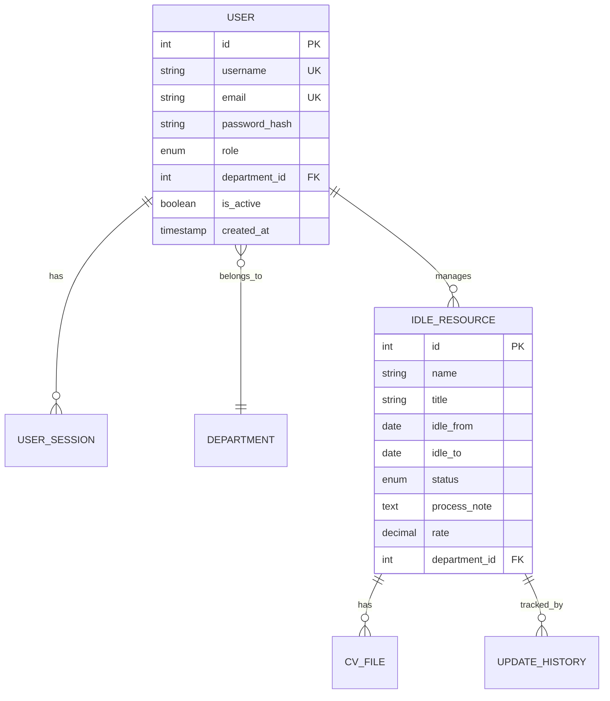
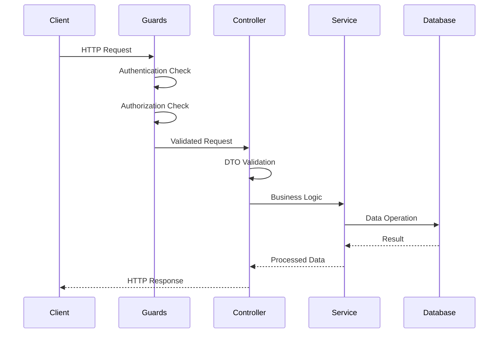
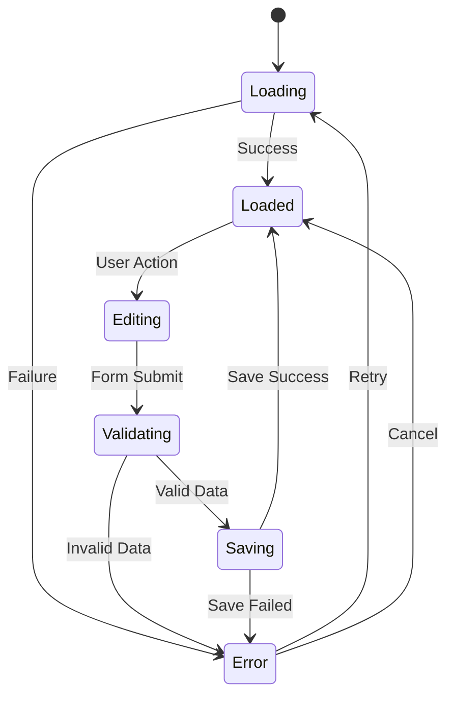
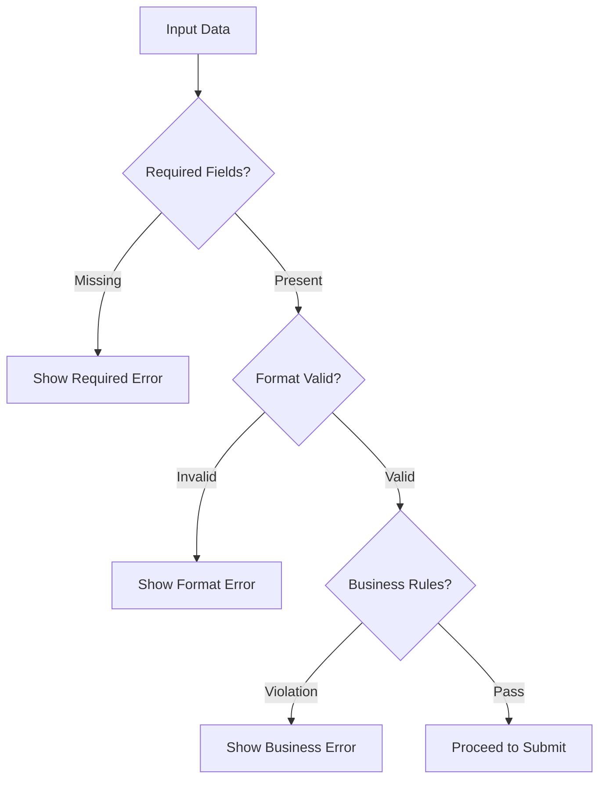
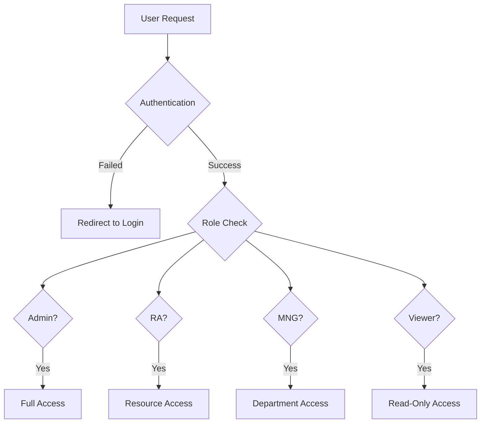

# Detail Design Template - Comprehensive Screen Design Guide

## Template này đảm bảo mô tả đầy đủ và chính xác cho việc triển khai

### Cấu trúc bắt buộc cho mỗi màn hình

---

## 📋 **PHẦN 1: TECHNICAL ARCHITECTURE OVERVIEW**

### 1.1 Technology Stack Matrix
| Layer | Technology | Version | Purpose |
|-------|------------|---------|---------|
| Frontend Framework | Next.js | 15.0.0 | React-based web framework |
| UI Library | Material-UI | 6.0.0 | Component library |
| CSS | tailwindcss |  | Component library |
| Form Handling | React Hook Form + Zod | 7.52.0 + 3.23.0 | Form validation |
| API Client | Axios + React Query | 1.7.0 + 5.51.0 | HTTP client & caching |
| Backend Framework | NestJS | 11.0.0 | Node.js framework |
| Database | MySQL + TypeORM | 8.0 + 0.3.20 | Database & ORM |
| Authentication | JWT + Passport | 10.2.0 + 10.0.3 | Auth strategy |

---

## 🗄️ **PHẦN 2: DATABASE DESIGN**

### 2.1 Entity Relationship Diagram


### 2.2 Table Schema Specifications
| Table Name | Columns | Primary Key | Foreign Keys | Indexes | Constraints |
|------------|---------|-------------|--------------|---------|-------------|
| users | id, username, email, password_hash, role, department_id | id (AUTO_INCREMENT) | department_id → departments(id) | username, email, role | UNIQUE(username), UNIQUE(email) |
| idle_resources | id, name, title, idle_from, idle_to, status, process_note, rate | id (AUTO_INCREMENT) | department_id → departments(id) | name, department_id, status | NOT NULL(name, idle_from) |
| user_sessions | id, user_id, session_token, expires_at | id (AUTO_INCREMENT) | user_id → users(id) | user_id, session_token | UNIQUE(session_token) |

### 2.3 Sample Data Structure
| Data Type | Example Values | Business Rules |
|-----------|----------------|----------------|
| User Roles | Admin, RA, MNG, Viewer | Hierarchical permissions |
| Resource Status | Active, Idle, Urgent, Closed | Status transitions |
| Date Ranges | idle_from, idle_to | idle_from ≤ idle_to |

---

## 🔧 **PHẦN 3: BACKEND API DESIGN**

### 3.1 API Endpoint Matrix
| Module | Endpoint | Method | Purpose | Request DTO | Response DTO | Guards |
|--------|----------|--------|---------|-------------|--------------|--------|
| Auth | /api/auth/login | POST | User login | LoginDto | AuthResponseDto | None |
| Auth | /api/auth/logout | POST | User logout | - | StatusDto | JwtGuard |
| Resources | /api/resources | GET | List resources | FilterDto | PaginatedDto | JwtGuard, RoleGuard |
| Resources | /api/resources | POST | Create resource | CreateResourceDto | ResourceDto | JwtGuard, RoleGuard |
| Resources | /api/resources/:id | PUT | Update resource | UpdateResourceDto | ResourceDto | JwtGuard, RoleGuard |

### 3.2 Request/Response Flow


### 3.3 Data Validation Rules
| Field Type | Validation Rules | Error Messages (EN/JP) |
|------------|------------------|------------------------|
| Required String | NotEmpty, MinLength(1) | "Field is required" / "必須項目です" |
| Email | IsEmail format | "Invalid email format" / "メール形式が無効です" |
| Date | IsDate, IsFutureDate | "Invalid date format" / "日付形式が無効です" |
| Enum | IsEnum(values) | "Invalid option selected" / "無効な選択肢です" |

---

## ⚛️ **PHẦN 4: FRONTEND ARCHITECTURE**

### 4.1 State Management Flow


### 4.2 Component Props Interface
| Component Type | Required Props | Optional Props | Event Handlers |
|----------------|----------------|----------------|----------------|
| Form Component | initialData, schema | disabled, loading | onSubmit, onChange |
| Table Component | data, columns | pagination, sorting | onSort, onPageChange |
| Action Button | label, action | disabled, loading | onClick |
| Input Field | name, value | placeholder, error | onChange, onBlur |

### 4.3 Responsive Design Breakpoints
| Device Type | Width Range | Layout Adjustments |
|-------------|-------------|-------------------|
| Mobile | < 768px | Stack vertically, hide columns |
| Tablet | 768px - 1024px | Reduce padding, simplified nav |
| Desktop | > 1024px | Full layout, all features |

---

## 🎨 **PHẦN 5: STYLING & UI SPECIFICATIONS**

### 5.1 Material-UI Theme Configuration
| Theme Property | Value | Usage |
|----------------|-------|-------|
| Primary Color | #1976d2 | Buttons, links, highlights |
| Secondary Color | #dc004e | Error states, warnings |
| Background | #f5f5f5 | Page background |
| Paper | #ffffff | Card backgrounds |
| Border Radius | 8px | Cards, buttons, inputs |

### 5.2 Component Styling Matrix
| Component | Desktop Style | Mobile Style | Hover/Focus States |
|-----------|---------------|--------------|-------------------|
| Data Table | Full width, fixed headers | Horizontal scroll | Row highlight |
| Form Fields | Standard spacing | Increased touch targets | Focus outline |
| Buttons | Standard padding | Larger touch area | Color transition |
| Navigation | Sidebar menu | Hamburger menu | Active state |

---

## ✅ **PHẦN 6: VALIDATION & BUSINESS RULES**

### 6.1 Client-side Validation Matrix
| Field Type | Required | Format Rules | Length Rules | Custom Rules |
|------------|----------|--------------|--------------|--------------|
| Username | ✅ | Alphanumeric + underscore | 3-50 chars | Unique check |
| Password | ✅ | Min 1 letter + 1 number | 6-100 chars | Strength check |
| Email | ✅ | Email format | 5-100 chars | Unique check |
| Date | ✅ | YYYY-MM-DD | - | Not future date |
| Rate | ❌ | Decimal | 0.0-5.0 | Valid range |

### 6.2 Business Rule Validation


### 6.3 Error Message Strategy
| Error Type | Display Location | Duration | User Action |
|------------|------------------|----------|-------------|
| Field Validation | Below field | Until corrected | Fix input |
| Form Validation | Top of form | 5 seconds | Review form |
| Server Error | Modal dialog | Until dismissed | Retry or cancel |
| Success Message | Snackbar | 3 seconds | Auto-dismiss |

---

## 🔒 **PHẦN 7: ROLE-BASED ACCESS CONTROL**

### 7.1 Permission Matrix
| Feature | Admin | RA | MNG | Viewer |
|---------|-------|----|----|-------|
| User Management | ✅ Full | ❌ None | ❌ None | ❌ None |
| Resource CRUD | ✅ All | ✅ All | ✅ Department | ❌ Read Only |
| File Operations | ✅ All | ✅ All | ✅ Department | ✅ Download |
| Dashboard Access | ✅ All | ✅ All | ✅ Department | ✅ Limited |
| Export Data | ✅ All | ✅ All | ✅ Department | ❌ None |

### 7.2 Data Access Control


### 7.3 UI Element Visibility
| UI Element | Show for Roles | Hide for Roles | Alternative Action |
|------------|----------------|----------------|-------------------|
| Create Button | Admin, RA, MNG | Viewer | Show disabled state |
| Delete Button | Admin, RA | MNG, Viewer | Hide completely |
| Edit Form | Admin, RA, MNG | Viewer | Show read-only |
| Export Menu | Admin, RA, MNG | Viewer | Show limited options |

---

## 🔍 **PHẦN 8: BUSINESS LOGIC SPECIFICATIONS**

### 8.1 Core Business Rules
```
// Bảng biểu hoặc diagram miêu tả giải thích cho All business rules
// Validation logic
// Calculation formulas
// State transitions
```

### 8.2 Data Transformations
```
// Entity to DTO mappings
// Form to API payload
// Response to display format
```

---

## 📊 **PHẦN 9: API ENDPOINT SPECIFICATIONS**

### 9.1 All Endpoints
```text
// GET /api/[resource] - List with filters
// GET /api/[resource]/:id - Get single
// POST /api/[resource] - Create
// PUT /api/[resource]/:id - Update
// DELETE /api/[resource]/:id - Delete
// POST /api/[resource]/bulk - Bulk operations
```

### 9.2 Request/Response Examples
```text
// Exact request payloads
// Response structures
// Error responses
// Status codes
```

---

## ❌ **PHẦN 10: COMPLETE ERROR HANDLING**

### 10.1 Error Scenarios
```text
// All possible errors
// Error codes
// Error messages (EN/JP)
// Recovery actions
```

### 10.2 Implementation
```text
// Backend exception filters
// Frontend error boundaries
// User error messaging
// Logging strategy
```

---

# 🎯 **CHECKLIST ĐỀ GENERATE CODE 100% CHÍNH XÁC**

## ✅ **Trước khi generate code, đảm bảo Detail Design có:**

1. **Database Schema hoàn chỉnh** với tất cả constraints, indexes, sample data
2. **API endpoints chi tiết** với exact request/response types
3. **Frontend component tree** với exact props và state
4. **Form validation schemas** với tất cả rules
5. **Error handling matrix** với mọi scenario
6. **Test cases đầy đủ** với mock data
7. **Performance requirements** cụ thể
8. **Role-based permissions** chi tiết
9. **Business logic algorithms** exact implementation
10. **Styling specifications** với exact Material-UI props

## 🚨 **LƯU Ý QUAN TRỌNG:**

- **Không có từ "tương tự", "như trên", "..." trong Detail Design**
- **Tất cả types phải match 100% giữa frontend và backend**
- **Business logic phải có step-by-step implementation**
- **Error handling phải cover 100% use cases**
